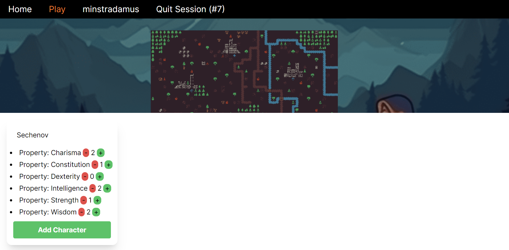
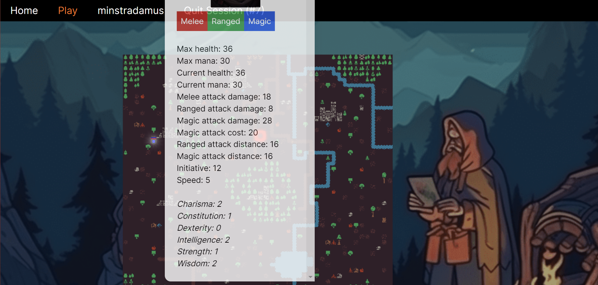
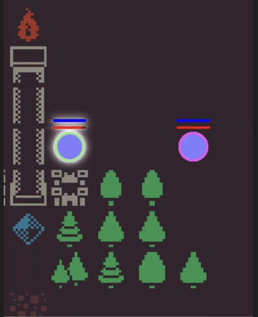
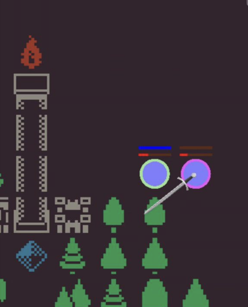
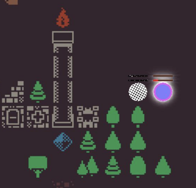

# RollPlayer

## What is RollPlayer?

It's not just an online platform for role-playing games; it's a symphony of strategy, a canvas of choices, and an epic tale waiting for you to script its next chapter. Are you ready to roll the dice and shape your destiny?

## How to play?

First, you need to create a session or join an existing one. When you create a session, you should choose a map for it, then tell your friends the ID of your session (shown at the top: Quit Session (#ID)) so they can join.

Then you and others need to create their characters. To create a character, first place your cursor on the white bar at the bottom to open up character creation panel. In there, you must choose the name for your character and configure the values for its Basic Properties.
The game has six Basic Properties: Charisma, Constitution, Dexterity, Intelligence, Strength, and Wisdom. All other properties (e.g. max HP, attack damage, etc.) are calculated based on these. You can only set them up once. The sum of all the Basic Properties has to be from 6 to 8 to prevent you from creating a too strong or too weak character. Once you're done, click "Add character".
Everyone can create a character whenever he or she wants; we recommend agreeing on the character creation rules in the game yourself.

To view all the properties of a character (basic properties, HP, MP, speed, etc.), right-click on it. You can also view them in the panel that you used to create the characters. Moreover, you can see the amount of mana and health in the form of two stripes above your character.

; 

Then the characters make turns in the order based on their initiative (a value depending on the Basic Properties). To make a move, click on your character and drag it to the desired square. The character whose turn it is to move will be marked with white halo. You move to a cell that's farther than your character's speed. Also, obstacles like trees, water, bad ground can restrict your movement. Instead of making a move, you can attack a character of another player on your turn.
The game features three types of attacks: Melee, Ranged, and Magic. To attack, click on your target with the right mouse button, and you'll see three buttons: Melee, Ranged and Magic. You can only attack a character that's in the range of your attack (see the 'Ranged/Magic attack distance' properties). Additionally, you can only perform Melee attack on a character that's directly next to your character. Distance plays a crucial role, regulating the attacks and emphasizing the strategic aspect. Magic attack will also cost your character mana.

There are cells in the game that either add or subtract health, alter the mana amount for magical attacks, and influence other characteristics. To monitor these changes, click on your character with the right mouse button.

When a character's health becomes lower than zero, it gets defeated. This means that it can neither move nor attack. On its turn it may come back to life with some probability.

You can also delete any of your characters by clicking X in the top-right corner of the character description on the character panel.
